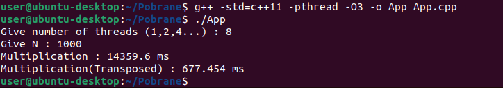

# MatrixMultiplication

Program for multiplying large matrices using the C++11 standard.

#### To compile this program in the Linux terminal, use the following command:
`g++ -std=c++11 -pthread -O3 -o App App.cpp`
<ul>
   <li>-std=c++11 : Specifies the use of the C++11 standard, which introduces modern features and improvements over previous C++ standards.</li>
   <li>-pthread : Enables multi-threading, allowing the program to run more efficiently when working with large matrices.</li>
   <li>-O3 : This is the highest level of optimization in GCC, which enables all optimizations that do not involve a space-speed tradeoff. It aggressively optimizes the code to improve performance, making it 
    especially useful for computationally intensive tasks like multiplying large matrices.</li>
</ul>

In addition to the usual multiplication of two matrices, I perform multiplication of a regular matrix by a transposed matrix, because it can lead to performance improvements. When one matrix is transposed, data is accessed in a way that may improve cache efficiency, especially when dealing with large matrices. Accessing elements in a transposed matrix aligns with the memory layout better, reducing cache misses and speeding up the multiplication process. This technique is commonly used in optimizing matrix operations in high-performance computing.

#### Additional Note
The reason why the multiplication time on the picture is so high is that the test was conducted on a virtual machine with a very limited number of processors.
<b>The larger the matrix, the more processors are required to handle the increased computational load. As matrix size increases, the multiplication becomes more resource-intensive, meaning a greater number of CPU cores is necessary to maintain efficient performance. Without enough processing power, computation time will increase significantly.</b>

#### Warning
<b>Multiplying two regular matrices takes much longer time than multiplying a matrix by a transposed matrix. In fact, the majority of the computational time in large matrix operations comes from this regular matrix multiplication. However, the exact performance and time consumption are highly dependent on the CPU and the total number of processing cores.</b>
